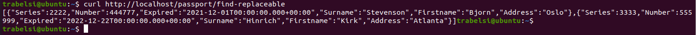
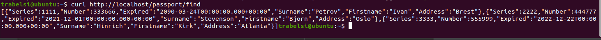

Микросервис для проверки паспортов. 
В качестве брокера сообщений используется Kafka. 
Стэк: Java 8+, Spring Boot, Liquibase, PostgreSQL,Lombok, Kafka, Docker, Kubernetes.

Приложение может быть развернуто с помощью docker compose.
Для этого:
1. предварительно неоходимо локально собрать проект с помощью:
mvn install.
2. собрать docker контейнер с помощью команды:
docker build -t passports .
3. и запустить docker-compose командо:
docker-compose up

Так же приложение может быть развернуто в Kubernetes.
Для этого:
1. развернуть Secret из файла postgresdb-secret.yml (указана учетная запись для подключения к БД) командой: kubectl apply -f postgresdb-secret.yml
2. развернуть ConfigMap из файла postgresdb-configmap.yml (адрес для подключения к БД и название БД) командой: kubectl apply -f postgresdb-configmap.yml
3. создать Deployment для БД из файла postgresdb-deployment.yml (описание переменных и портов для службы с БД) командой: kubectl apply -f postgresdb-deployment.yml
4. создать Deployment для самого приложения из файла passports-deployment.yml командой: kubectl apply -f passports-deployment.yml
5. проверить статус работы приложения а узнать адрес подключения можно с помощью команды: minikube service passport-service
